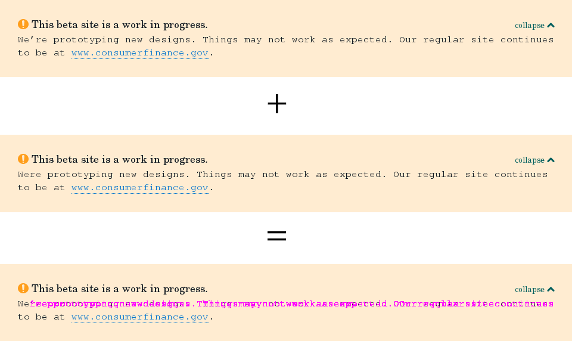

# SanityBox

A proof-of-concept for testing visual CSS regression testing.
Runs WebdriverCSS inside a Vagrant Ubuntu virtual machine and provides commands
for generating a baseline of images and a regression diff of images after a
change has been made.

Example coverage is provided against [cfgov-refresh](https://github.com/cfpb/cfgov-refresh),
the in-progress redesign of the consumerfinance.gov website.



**Status:** pre-alpha.
It's unstable and makes a drive down a pebble beach feel smooth,
but then again…
you're on a beautiful beach with an ocean of possibilities in front of you.

### Why? What motivates this project?

Sometimes you just want to make a change to some CSS and have the peace of mind
it didn't break something _somewhere_.
Manually checking is time-consuming and error prone. Wouldn't it be nice to have
a VM you could load a bunch of URLs and screen sizes into and it'd spit back a
before and after image of changes? This is Visual CSS Regression Testing, and
yes it would be nice.

### The road ahead

This runs with a standalone Selenium Server,
but it should be able to work with a Selenium Server in the cloud,
ala [Sauce Labs](http://saucelabs.com).


## Dependencies

  - [VirtualBox](http://virtualbox.org)
  - [Vagrant](http://vagrantup.com)

## Installation
Follow the instructions in the [INSTALL](INSTALL.md) document.

## Configuration

### What's in the box?

  - Git
  - Node.js
  - PhantomJS
  - Selenium
  - [Webdriver.io](https://github.com/webdriverio/webdriverio)
  - [WebdriverCSS](https://github.com/webdriverio/webdrivercss) (Webdriver.io plugin)

## Usage

> **Note:** For the following commands:<br>
  `host $` refers to the command prompt on your computer's OS.<br>
  `guest:~$` refers to the virtual machine (VM).

After the installation has finished,
you can log into the VM with the following command:

```bash
host $ vagrant ssh
…
guest:~$
```

The console will now be controlling the VM.

### Running separate console panes

#### Creating and swapping panes with tmux
In order to control the different processes needed for the project use
tmux to swap between panes in the terminal. Start tmux with:

```bash
guest:~$ tmux
```

 1. Press the `ctrl`+`b` keys and enter `"` to split the pane vertically.
 2. Press the `ctrl`+`b` keys and enter `o` to swap between the two panes.

You'll use this to start the Selenium Server and then swap to another pane
to run WebdriverCSS against Selenium.
See [this gist](https://gist.github.com/MohamedAlaa/2961058) for additional tmux commands.

### Starting Selenium Standalone Server

```bash
guest:~$ selenium_start
```

To stop Selenium once it has started, use the command:

```bash
guest:~$ selenium_stop
```

### Running regression tests
  1. Ensure you have the project you want to test running on the host machine,
     and that the port you want to check matches that in
     the `baseUrl`in `bin/targets.yml`.
  2. In a new tmux pane, change to the bin directory with `cd bin`.
  3. Run `nodejs testdriver.js`. This creates new baseline images
     in the `bin` directory if none exist already, or regression images
     if there is a difference from the baseline.
  4. To regenerate the baseline images,
     throw out the `bin/*_regression_tests` directory.

### Changing test parameters
The pages to visit is configured in `bin/targets.yml`,
where you can set the URL to visit,
the element to screenshot (the `body` gets the whole page),
and the height and width of the screenshot.
To screenshot responsive sizes, add additional `screenWidth` settings.

 - `project` = A name for the project,
   which gets prefixed on the `bin/*_regression_tests` directory.
 - `baseurl` = The URL of the project running on the host computer.
 - `url` = The URL for the page (appended to the `baseUrl` when making requests).
 - `data` = An object with any of the options from the [WebdriverCSS settings](https://github.com/webdriverio/webdrivercss#usage).

### Stoping the VM
Stop the VM by entering the following in the VM directory on the host computer:

```bash
host $ vagrant halt
```

## Known issues

### I add more pages but everything is the homepage!
Yup, this is definitely pre-alpha.
Webdriverio can visit multiple pages,
but the screenshots appear to happen before the
page has navigated away from the homepage.
At the moment this proof-of-concept is only working on one page at a time
(but multiple responsive sizes at a time work).

### The generated images are blank!
Check that the server you want to test is actually running on the host.

### There are all kinds of connection refused errors
Sometimes the PhantomJS sessions seem to get locked up.
Manually kill them by looking up the PID with `ps aux | grep 'phantomjs'`
and kill them with `kill <PID>`,
where `<PID>` is the ID of the one you want to kill.
Restart the Selenium Server with `selenium_start`.

### The fonts don't look right and lead to false positive diffs
Yeah, sometimes it seems the fonts haven't fully loaded before the
screenshot is taken. Best I can say is throw out the `bin/*_regression_tests`
directory and re-run it to generate new baseline images.

## Getting help

If you have questions, concerns, bug reports, etc, please file an issue in this repository's Issue Tracker.

## Getting involved

Make it better! It needs to work with Sauce Labs. It needs to handle multiple pages
(not just sizes) at once.

The [CONTRIBUTING](CONTRIBUTING.md) document contains general contribution advise.


----

## Open source licensing info
1. [TERMS](TERMS.md)
2. [LICENSE](LICENSE)
3. [CFPB Source Code Policy](https://github.com/cfpb/source-code-policy/)
